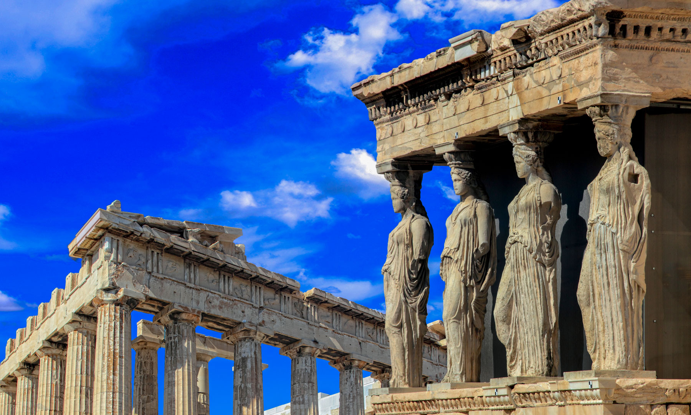
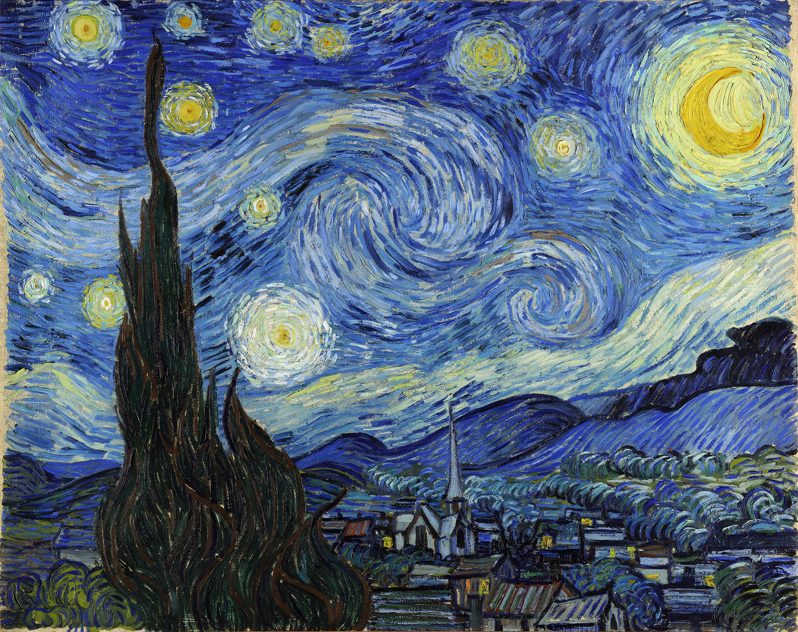
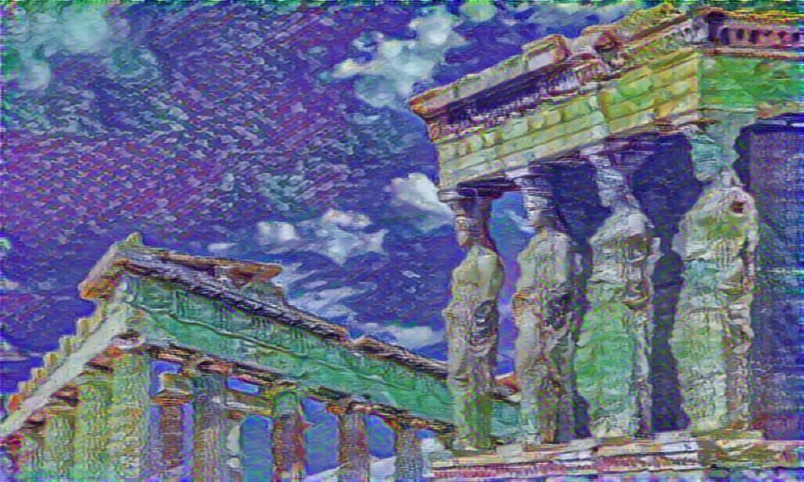
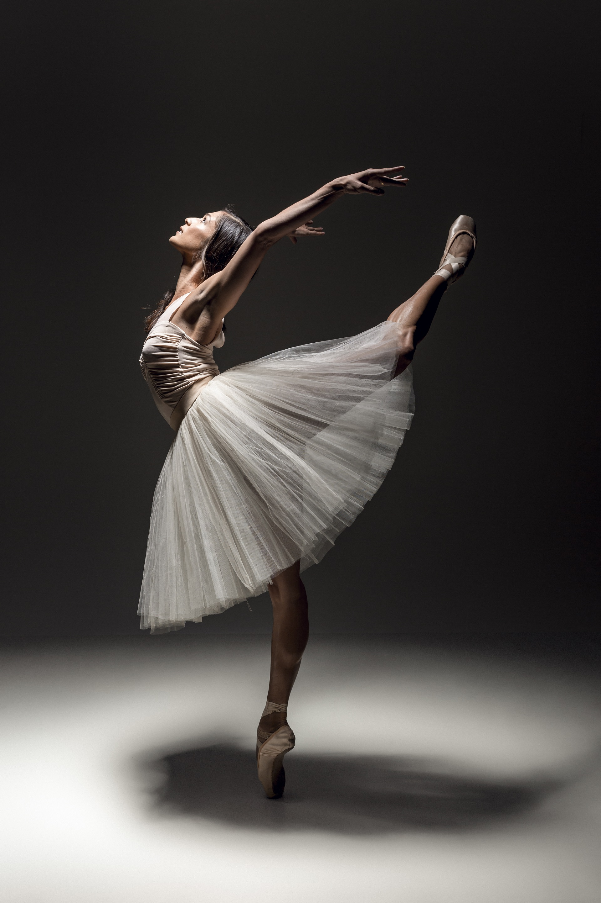
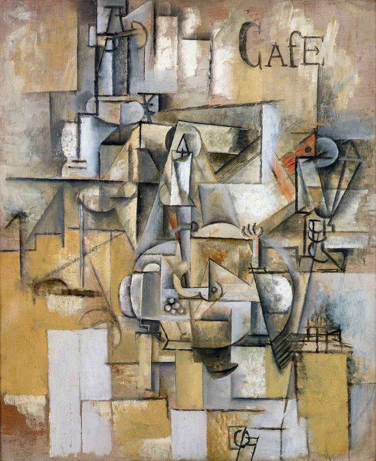
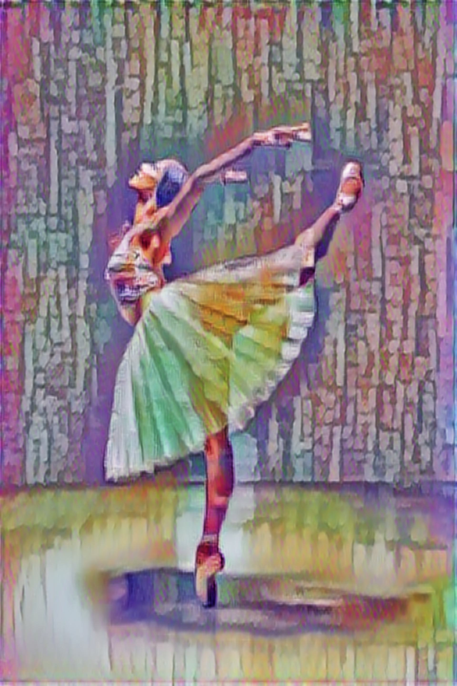

# Fast Arbitrary Neural Style Transfer with Tensorflow-hub

Combine the details of one image with the artistic style of another.

## Problem

* take two arbitrary images
* feed those into a pretrained model that creates a stylized image from a single forward pass
* return and save that new image

## Recources

The model that is being used in this project comes from: https://kaggle.com/models/google/arbitrary-image-stylization-v1/frameworks/TensorFlow1/variations/256/versions/1

## Examples

<p>



</p>
<p>



</p>

## Installation

Use [pip](https://pip.pypa.io/en/stable/) to install requirements.

```bash
git clone https://github.com/cian-ps/fast_arbitrary_nst.git
cd fast_arbitrary_nst
pip install -r requirements.txt
```

## Usage

```bash
python main.py --content <path/to/content_image.jpg> --style <path/to/style_image.jpg>
```